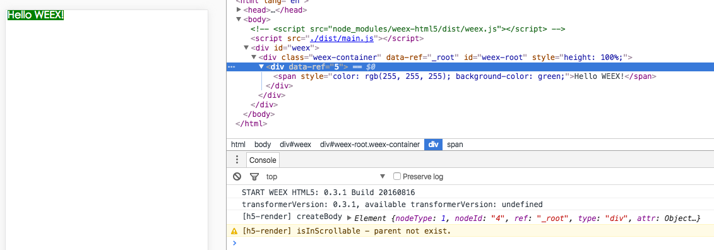

# weex_extend_demo

This is a simple demo for weex to extend a self-defined component on web platform using weex-html5. In this demo we use the created component named 'mine' and installed it to run.

[The other repo weex-hello](https://github.com/MrRaindrop/weex-hello) contains the code of component's defining and specifying its attribute, style and events. You can set up your attribute setters, style setters and event configuration in your component's implementation, and also override the methods like 'create' of the base class 'Component'.

## STEPS to demonstrate

1. `npm install`
2. `npm run transform`
3. `npm run build`
4. `npm run serve`
5. visit `http://localhost:12580/index.html`, then you'll see the demo page.

## STEPS for extending

1. require the `weex-html5` to do all the rendering work.
2. you can publish your self-defined component in npm. In this demo, we use the already published component `weex-hello` in our project. You can go to the [repo of weex-hello](https://github.com/MrRaindrop/weex-hello) to see the component's defining code.
3. in your bootstrap file, import the component and install it.
4. do the initializing work for rendering `.we` page. It's all in the `src/main.js` file.
5. visit the page.

## REFS

* [weex-hello](https://github.com/MrRaindrop/weex-hello)
* [extending to web](http://alibaba.github.io/weex/doc/advanced/extend-to-html5.html)
* [extending to web(cn)](https://github.com/weexteam/article/issues/11)
* [website of weex](http://alibaba.github.io/weex/)
